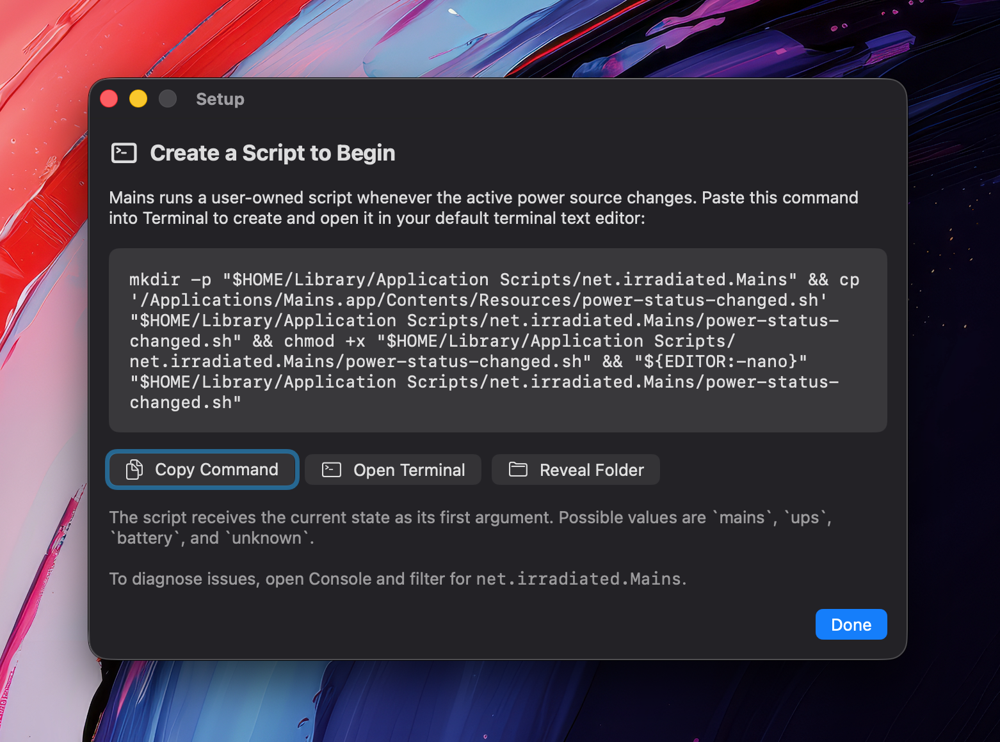

# Mains

Mains is a simple macOS menu bar app that runs a user script when the Mac's power source changes. This enables getting remote push notifications through a service like Pushover among other use cases.

## Screenshots




## How it Works

The app watches for mains power, UPS, battery, and unknown power states. On each state transition, it runs:

```text
~/Library/Application Scripts/net.irradiated.Mains/power-status-changed.sh
```

The script receives the current state as its first argument:

```text
mains
ups
battery
unknown
```

## Setup

Open Mains, then use **Settings > Setup > Open Instructions** to create the default script.

The setup command copies the bundled template script into the app's Application Scripts folder, marks it executable, and opens it in your terminal editor.
